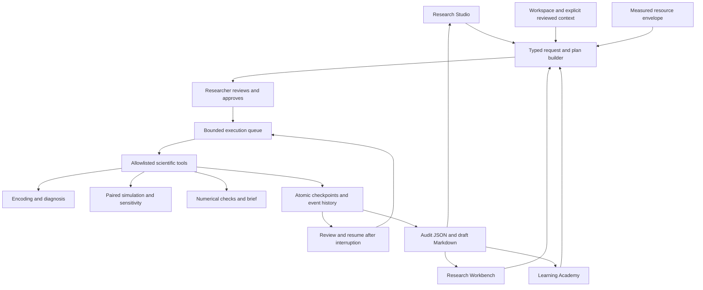

# NIDM scientific research environment

The shipped FastAPI application now serves three connected interfaces:

| Route | Experience | Implemented workflow |
| --- | --- | --- |
| `/` | Research Studio | Question and evidence → reviewable plan → approved execution → inspect and review artifacts |
| `/workbench` | Research Workbench | Explicit model, horizon and intervention controls; reopen or derive experiments without losing context |
| `/academy` | Learning Academy | Three runnable lessons, experiment outputs, answer feedback and persisted understanding checks |

A shared navigation, workspace selector, experiment history and addressable URLs
connect these experiences. The redesign uses bundled HTML/CSS/JavaScript without
an external font service, CDN, Node build or model API dependency.

Existing capabilities remain available at `/classic-workbench` (evidence ledger,
structured ingestion, advanced modelling, publication), `/academy/reference`
(the original reference curriculum), and `/classic-studio` (the earlier studio and
its `/research` saved-run history). Old runs are preserved, not automatically
converted into checkpointed experiments. The root `app/`, `client/`, `frontend/`
and Cloudflare static pages are not the new FastAPI interface. Cloudflare has not
been deployed or converted to execute this Python harness.

## DeerFlow architecture study and adaptation

Source inspected on 2026-09-09 at upstream commit
`05432f4b437fc5413008d571a4ac138668558418`:

- [Architecture](https://github.com/bytedance/deer-flow/blob/05432f4b437fc5413008d571a4ac138668558418/backend/docs/ARCHITECTURE.md)
- [Lead-agent assembly](https://github.com/bytedance/deer-flow/blob/05432f4b437fc5413008d571a4ac138668558418/backend/packages/harness/deerflow/agents/lead_agent/agent.py)
- [Thread state and reducers](https://github.com/bytedance/deer-flow/blob/05432f4b437fc5413008d571a4ac138668558418/backend/packages/harness/deerflow/agents/thread_state.py)
- [Bounded subagent execution and cancellation](https://github.com/bytedance/deer-flow/blob/05432f4b437fc5413008d571a4ac138668558418/backend/packages/harness/deerflow/subagents/executor.py)

DeerFlow separates agent assembly, middleware, tools, thread state, artifacts and
execution capacity. Its executor carries explicit task state and cancellation,
while its state reducers define how independently produced state is merged. NIDM
adopts those separation and lifecycle ideas around an allowlist of domain tools.
This is an independent implementation, not a DeerFlow runtime transplant.

| Pattern | NIDM implementation | Boundary |
| --- | --- | --- |
| Harness / tool separation | `engine_harness.py` coordinates; `engine_tools.py` calls scientific functions | No arbitrary code, shell, remote tools or general LLM reasoning |
| Reviewable planning | Typed request → immutable method/step/context snapshot → explicit execution approval | Intent rules select evidence, scenario or sensitivity; they cannot answer arbitrary requests |
| Durable state | Atomic per-tool JSON checkpoints and sequenced events | One owning server process per data directory |
| Bounded execution | 1–2 worker threads, at most 8 outstanding jobs, 30-second cooperative attempt budget | A Python function already executing is not forcibly interrupted |
| Artifacts | Addressable JSON audit and Markdown brief | No implicit ledger write or publication |
| Context | Workspace settings, provenance, language, expertise, up to 3 explicitly attached reviewed findings | Review notes never silently alter model parameters |
| Resource selection | CPU affinity/quota and available memory choose a disclosed sweep profile | No implicit scientific model replacement |
| Learning | Lessons execute the same tools and require a completed run plus a correct check | Educational progress, not a professional competency credential |

## Architecture



The first complete workflow is a narrative-driven controlled comparison and
optional one-parameter sensitivity sweep. The numerical implementations in
`modelling.py`, `encoding.py` and `inoculation.py` remain the scientific source of
truth. UI charts render their actual outputs; no progress events or curves are
simulated in the browser.

## Execution and persistence contract

1. Building a plan saves the supplied evidence and context in the selected
   workspace. It performs no encoding or simulation. The UI identifies workspace
   persistence before this action.
2. Approval enqueues the saved plan. Inputs cannot be edited in place; use “Edit as
   new experiment” to create another plan.
3. Each completed tool output is atomically checkpointed with timestamped events.
   Reloading or changing pages does not cancel the job. The UI polls durable state.
4. Stop persists a cancellation request. The worker checks it before and after
   each tool call. If cancellation wins, an in-flight output is not published.
5. An orderly server shutdown stops at tool boundaries. On restart, queued,
   running and cancelling checkpoints become interrupted. Resume requires an
   explicit action and skips completed tools. Code or environment changes require
   a new plan rather than combining incompatible checkpoints.
6. Completed runs can receive a researcher review. JSON snapshots are available
   throughout execution; a completed Markdown brief is available only after the
   workflow completes. Partial runs remain clearly marked.
7. Deletion requires a stopped run and removes its checkpoint, events, artifacts,
   review and lesson check. Existing exports and backups remain. References or
   review excerpts already explicitly attached to later experiments remain part
   of those experiments' provenance.

Files live at `workspaces/<workspace>/evidence/engine-runs/<uuid>.json` within the
configured data directory. Existing full workspace backups include them; template
exports and template duplication exclude them. Imported full backups use the new
workspace ID for access while retaining original request provenance. Corrupt files
are retained and logged; they do not prevent other experiments from being listed.
There is no automatic expiry policy.

An exclusive SQLite owner lock prevents two harness processes sharing the same
data directory. Use one Uvicorn worker. This does not provide distributed jobs,
a shared deployment lease protocol, or hard process isolation. The existing
application has no user authentication; all users who can reach one instance can
access its workspaces. Workspace IDs are organizational scope, not access control.

## Resource and context adaptation

The default profile uses measured CPU affinity, cgroup CPU quotas, `/proc/meminfo`
and cgroup memory headroom when available. Unknown memory conservatively selects
economy. Profile sizes are economy=3, balanced=7, thorough=11 intervention strengths
spanning 0–1. Profiles change sweep resolution only; the researcher sees the exact
grid before approving it. Worker capacity is chosen at server startup, with serial
steps inside each experiment. A user-selected larger profile is disclosed rather
than silently reduced. These controls are conservative bounds, not an adaptive
GPU scheduler or benchmark-based runtime predictor.

The capability panel reports optional dependencies and configured provider
credential presence, without exposing secrets. Connectivity and model availability
are explicitly **not probed**. All implemented tools work offline; provider cost
is zero because no model-provider calls occur. Local compute cost is not estimated.

Workspace country/domain and version, evidence language, declared source permission,
source name and user expertise enter the plan. Expertise changes explanations;
it does not change scientific methods. Prior reviewed notes must be attached
explicitly, with their run IDs and timestamps. The English keyword encoder blocks
non-English execution with an actionable explanation. Researchers must supply an
explicit translation; the engine does not silently translate or claim multilingual
validity.

## Scientific interpretation and reproducibility

Every experiment retains the research question separately from source evidence,
source SHA-256, declared provenance, request parameters, selected method, resource
profile/grid, tool outputs, ordered events, code fingerprint, Python/package
versions and random-seed applicability. These tools are deterministic and do not
use a random seed. Model defaults are defined in the fingerprinted scientific
implementation; this is not a claim that every implicit default has been expanded
into the request. An audit bundle needs the matching code environment to reproduce
execution; it is not a self-contained executable environment.

- Keyword scores and diagnosis are interpretations requiring source review, not
  validated measures, factual verification or prevalence estimates.
- Baseline and intervention share evidence and parameters except intervention
  strength. With zero strength their deterministic trajectories must match.
- The existing agent-based proxy ignores intervention strength; the planner blocks
  that comparison instead of substituting a model. Hybrid adoption remains a
  disclosed 55% compartmental / 45% proxy blend.
- Numerical checks cover finite outputs, bounded adoption and post-normalization
  compartment totals. Since the model normalizes each update, this does **not**
  establish raw ODE conservation, solver accuracy or empirical validity.
- Sensitivity is a one-parameter grid, not posterior inference. Existing uncertainty
  bands are heuristic envelopes, not statistical confidence intervals.
- No empirical calibration, causal identification or general forecast validation
  is added by this change. A saved review note does not certify those properties.

## API and code map

| File or route | Responsibility |
| --- | --- |
| `engine_harness.py` | Typed requests, bounded plan builder, job lifecycle and HTTP API |
| `engine_tools.py` | Scientific adapters, checks, brief and code fingerprint |
| `engine_resources.py` | Resource probe and environment manifest |
| `engine_store.py` | Atomic checkpoints, history and events |
| `engine_lessons.py` | Lesson content and answer contracts |
| `engine_ui.py`, `engine_assets/` | Shared shell and three distinct interactive entry points |
| `POST /engine/plans` | Save an unexecuted plan |
| `GET /engine/capabilities` | Resource measurements and explicit capability limits |
| `GET /engine/workspaces/{id}/runs` | Paginated history (`offset`, `limit`) |
| `GET /engine/workspaces/{id}/runs/{run}` | Full durable state |
| `POST .../{run}/start`, `/cancel`, `/resume` | Explicit lifecycle transitions |
| `POST .../{run}/review` | Persist a researcher note |
| `GET .../{run}/artifacts/{json\|brief}` | Audit or completed draft download |
| `DELETE .../{run}` | Delete a stopped experiment |
| `GET /engine/lessons` | Public lesson content |
| `POST /engine/workspaces/{id}/lessons/{lesson}/check` | Check an answer tied to a completed lesson run |

## Local testing

```bash
NDIM_DATA_DIR=/tmp/nidm-persistence-preview .venv313/bin/python -m uvicorn app.main:app --app-dir backend --host 127.0.0.1 --port 8010
.venv313/bin/python scripts/test_engine.py
.venv313/bin/python scripts/test_research.py
.venv313/bin/python scripts/smoke_test.py
```

Use an environment with the backend dependencies if `.venv313` is unavailable.
Open `/`, choose a synthetic task, review the plan, then approve it. Follow the
Workbench link, edit as a new experiment and set intervention strength to zero.
Open the Academy, run a lesson and answer its understanding check. Reload the URL
to verify experiment and progress persistence. Test the layout on mobile as well.

`scripts/verify_engine_browser.js` runs these three browser phases in order,
returning the next route after each phase. It verifies genuine artifacts and tool
outputs, literal evidence rendering, the zero-intervention control, review notes,
and lesson feedback. `scripts/test_engine.py` tests cancellation races, duplicate
start rejection, resume, recovery, code guards, workspace scope, backups, resource
profiles and scientific output consistency. The older research and production
smoke suites cover retained compatibility and ingestion.

## Remaining architecture increments

This is a complete local domain workflow and a substantial three-surface redesign,
not a general autonomous scientific assistant. Further increments are:

1. Authenticated workspace ownership and explicit retention policies for shared hosting.
2. A provider-backed planner with schema-validated tool requests, measured token/cost
   budgets, consent for evidence transfer and an offline rules fallback identified
   as a different planning mode.
3. Durable isolated workers and distributed coordination for long or untrusted
   computation; hard timeouts require process isolation.
4. Institutional MCP connectors and bounded specialist LLM delegation, with
   provenance and scoped permissions. Neither is simulated in this interface.
5. Scientific expansion: validated multilingual encoding, actual agent-level models,
   parameter estimation against field observations, solver diagnostics and
   statistically grounded uncertainty with explicit validation datasets.
6. Migrate the remaining advanced ledger/publication/reference workflows into the
   new shell without losing their governance controls.
